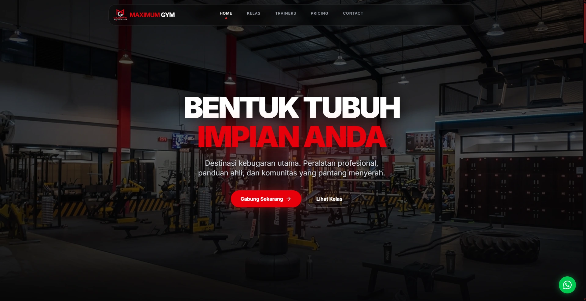
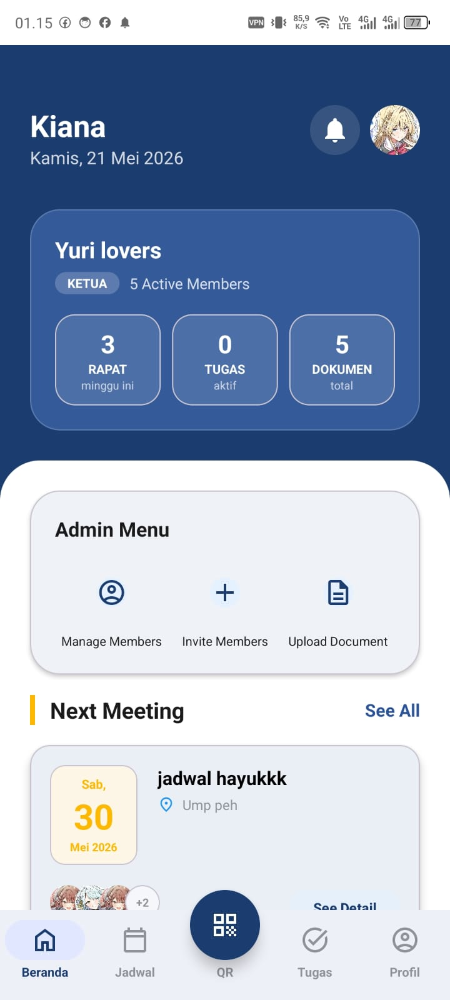

# Portofolio 3D — Denanda Ukky

Portofolio 3D is an experimental cinematic portfolio built around immersive web animation, scroll-driven storytelling, React Three Fiber, and one interconnected digital universe. Instead of presenting the work as a conventional page of independent sections, the site carries the visitor through a continuous visual journey from the Hero to the Final Signal.

## Preview

No repository preview image is included yet.

## Live Demo

Deployment link will be added after publishing.

## Concept

This website is intentionally different from a conventional practical portfolio. It explores how a personal portfolio can feel like a directed experience through:

- cinematic web animation;
- interactive 3D environments;
- scroll-controlled camera movement;
- editorial typography;
- sound-reactive experiences; and
- continuous visual storytelling.

## Journey Chapters

The application follows this narrative order:

1. Hero
2. Cosmic POV
3. Planet Entry
4. Memory Chamber
5. System Core
6. Digital Archive
7. Listening Capsule
8. Void Thought
9. Final Signal

## Main Features

- A persistent React Three Fiber world connecting the main journey chapters.
- A scroll-driven 3D camera with calibrated chapter arrival and readable hold phases.
- A cinematic Cosmic POV tunnel with responsive paths, particles, bloom, and journey threads.
- World-anchored project vaults generated from centralized project data.
- A user-initiated audio player for a selected excerpt of “Good Life.”
- Web Audio analyser data driving particle, waveform, node, and orbital reactions.
- Adaptive navigation with chapter-aware state and programmatic journey-progress targeting.
- Dedicated desktop, tablet, mobile portrait, and mobile landscape choreography.
- Responsive particle density, camera field of view, rendering pixel ratio, and scroll pacing.
- Reduced-motion handling for visitors who prefer less animation.
- A causal Void Thought handoff from quote fragments into the Final Signal.
- A black-hole-inspired contact destination with an interactive signal dock.

## Featured Projects

### Maximum Gym

A responsive company-profile website created as the digital identity of a fitness center. The project presents the Maximum Gym brand through a modern, accessible interface designed for clear exploration across screen sizes.



[Visit Maximum Gym](https://maximum-gym-black.vercel.app/)

### OrgaKu

An Android organization-management application that brings operational tools into one coordinated experience. Its documented features include:

- email/password authentication and Google Sign-In;
- task and sub-task management;
- meeting schedules;
- QR-code attendance;
- attendance export to Excel;
- organizational documents;
- real-time push notifications;
- member invitations; and
- dark mode.



No public OrgaKu deployment link is currently provided.

## Technology Stack

- **React 19** and **React DOM** for the application interface.
- **TypeScript** for typed application code.
- **Vite** for local development and production builds.
- **Three.js** for the underlying 3D scene graph and rendering primitives.
- **React Three Fiber** for declarative Three.js scenes in React.
- **Drei** for world-anchored HTML inside the 3D journey.
- **React Three Postprocessing** for bloom and scene finishing.
- **Motion for React** for scroll-linked and interface animation.
- **GSAP** for the pointer-reactive Hero composition.
- **Tailwind CSS 4** for utility styling alongside the custom cinematic stylesheet.
- **Lucide React** for interface controls in the Listening Capsule.
- **Web Audio API** for analyser-driven audio reactions.

## Project Structure

```text
.
├── public/
│   ├── Music/
│   │   └── Good-life.mpeg
│   ├── Hero1.webp
│   ├── Hero2.webp
│   ├── Maximum-Gym.webp
│   ├── Meteor.webp
│   ├── Orgaku.jpeg
│   └── Person1.jpeg
├── src/
│   ├── components/
│   │   ├── layout/
│   │   ├── sections/
│   │   └── ui/
│   ├── data/
│   ├── hooks/
│   ├── lib/
│   ├── App.tsx
│   ├── index.css
│   └── main.tsx
├── index.html
├── package.json
├── tsconfig.json
└── vite.config.ts
```

Important implementation areas:

- `PlanetWorldJourneySection.tsx` coordinates the persistent world, camera, and semantic chapter timeline.
- `CosmicPOVSection.tsx` implements the opening tunnel journey.
- `archiveJourney.ts` defines archive camera checkpoints and responsive scroll remapping.
- `journeyNavigation.ts` centralizes navbar labels, chapter thresholds, and navigation targets.
- `useResponsiveProfile.ts` selects the desktop, tablet, or mobile choreography profile.

## Getting Started

### Prerequisites

- Node.js 20 or newer is recommended.
- npm is used by the included lockfile.
- A modern browser with WebGL and Web Audio support is required for the complete experience.

### Installation

```bash
git clone https://github.com/kianawoz7-sys/Portofolio-3D.git
cd Portofolio-3D
npm install
npm run dev
```

Vite serves the development site on `http://localhost:3000` by default.

No environment variable is currently required by the client application.

## Available Scripts

```bash
npm run dev      # Start the Vite development server on port 3000
npm run lint     # Run the TypeScript no-emit validation
npm run build    # Create a production build in dist/
npm run preview  # Preview the production build locally
```

## Interaction Notes

- Scrolling advances the cinematic world and its camera timeline.
- The adaptive navbar jumps to stable reading phases inside the pinned journey.
- Listening Capsule audio starts only after explicit user interaction.
- Visitors with `prefers-reduced-motion: reduce` receive simplified motion.
- Rendering density and journey pacing adapt to desktop, tablet, mobile portrait, and mobile landscape viewports.

## Content and Media

The repository includes the visual and audio assets required by the portfolio experience. Project imagery belongs to its respective project context. The included music excerpt and associated references remain the property of their respective rights holders and are presented here as part of a personal, non-commercial portfolio experience.

## Author

**Denanda Ukky**

- [GitHub](https://github.com/kianawoz7-sys)
- [LinkedIn](https://www.linkedin.com/in/kiana-woz-017308378)
